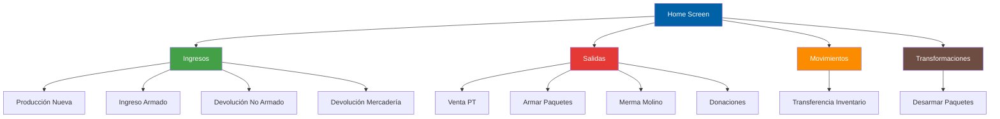

## Overview

EnvaSistema is built using modern Android development practices with **Kotlin**, **Jetpack Compose**, and **Material 3**. The application follows a clean, modular architecture designed for warehouse management operations.

## Technology Stack

<CardGroup cols={2}>
  <Card title="Language" icon="code">
    Kotlin 2.2.10
  </Card>
  <Card title="UI Framework" icon="palette">
    Jetpack Compose with Material 3
  </Card>
  <Card title="Navigation" icon="route">
    Navigation Compose 2.8.5
  </Card>
  <Card title="Build System" icon="hammer">
    Gradle with Version Catalog
  </Card>
</CardGroup>

## Project Structure

```
EnvaSistema/
├── app/
│   ├── src/main/java/com/example/envasistema/
│   │   ├── MainActivity.kt
│   │   └── ui/
│   │       ├── components/          # Reusable UI components
│   │       ├── navigation/          # Navigation graph
│   │       ├── screens/             # Screen-level composables
│   │       │   ├── home/
│   │       │   ├── ingresos/
│   │       │   ├── salidas/
│   │       │   ├── movimientos/
│   │       │   └── transformaciones/
│   │       └── theme/               # Theme configuration
│   └── build.gradle.kts
├── build.gradle.kts
├── settings.gradle.kts
└── gradle/
    └── libs.versions.toml           # Version catalog
```

## Architecture Layers

### 1. Application Entry Point

The app starts with `MainActivity`, which sets up the Compose environment and applies the theme.

<CodeGroup>

```kotlin MainActivity.kt
package com.example.envasistema

import android.os.Bundle
import androidx.activity.ComponentActivity
import androidx.activity.compose.setContent
import androidx.compose.foundation.layout.fillMaxSize
import androidx.compose.material3.MaterialTheme
import androidx.compose.material3.Surface
import androidx.compose.ui.Modifier
import com.example.envasistema.ui.navigation.AppNavigation
import com.example.envasistema.ui.theme.EnvaSistemaTheme

class MainActivity : ComponentActivity() {
    override fun onCreate(savedInstanceState: Bundle?) {
        super.onCreate(savedInstanceState)
        setContent {
            EnvaSistemaTheme {
                Surface(
                    modifier = Modifier.fillMaxSize(),
                    color = MaterialTheme.colorScheme.background
                ) {
                    AppNavigation()
                }
            }
        }
    }
}
```

</CodeGroup>

### 2. Navigation Architecture

EnvaSistema uses **Navigation Compose** with a sealed class pattern for type-safe routing.

<Accordion title="Navigation Implementation">

```kotlin AppNavigation.kt
sealed class Screen(val route: String) {
    object Home : Screen("home")
    
    // Ingresos
    object Ingresos : Screen("ingresos")
    object ProduccionNueva : Screen("produccion_nueva")
    object IngresoArmado : Screen("ingreso_armado")
    object DevolucionNoArmado : Screen("devolucion_no_armado")
    object DevolucionMercaderia : Screen("devolucion_mercaderia")
    
    // Salidas
    object Salidas : Screen("salidas")
    object VentaPT : Screen("venta_pt")
    object ArmarPaquetes : Screen("armar_paquetes")
    object MermaMolino : Screen("merma_molino")
    object Donaciones : Screen("donaciones")
    
    // Others
    object Movimientos : Screen("movimientos")
    object Transformaciones : Screen("transformaciones")
}

@Composable
fun AppNavigation() {
    val navController = rememberNavController()

    NavHost(navController = navController, startDestination = Screen.Home.route) {
        composable(Screen.Home.route) {
            HomeScreen(
                onIngresosClick = { navController.navigate(Screen.Ingresos.route) },
                onSalidasClick = { navController.navigate(Screen.Salidas.route) },
                onMovimientosClick = { navController.navigate(Screen.Movimientos.route) },
                onTransformacionesClick = { navController.navigate(Screen.Transformaciones.route) }
            )
        }
        // ... additional routes
    }
}
```

</Accordion>

**Key Features:**

- Type-safe navigation with sealed classes
- Single `NavController` instance managed at app level
- Lambda-based navigation callbacks for decoupled screens
- Hierarchical navigation structure (Home → Category → Detail)

### 3. UI Layer Structure

#### Screens
Screen composables represent full-page views and handle:
- User interactions
- Navigation callbacks
- Layout composition using reusable components

#### Components
Reusable UI components are location-agnostic and handle:
- Visual presentation
- Local state management
- Callback-based interactions

See [UI Components Reference](/technical/ui-components) for detailed documentation.

#### Theme
Centralized theming using Material 3:
- Dynamic color support (Android 12+)
- Custom color palette
- Typography configuration

## Build Configuration

### Module Configuration

<ParamField path="namespace" type="string" default="com.example.envasistema">
  Application package namespace
</ParamField>

<ParamField path="compileSdk" type="int" default="35">
  Target compilation SDK version
</ParamField>

<ParamField path="minSdk" type="int" default="33">
  Minimum supported Android version (Android 13)
</ParamField>

<ParamField path="targetSdk" type="int" default="35">
  Target Android SDK version
</ParamField>

### Key Dependencies

```toml libs.versions.toml
[versions]
agp = "9.1.0"
kotlin = "2.2.10"
composeBom = "2024.09.00"
navigationCompose = "2.8.5"
coreKtx = "1.10.1"
lifecycleRuntimeKtx = "2.6.1"
activityCompose = "1.8.0"

[libraries]
androidx-compose-material3 = { group = "androidx.compose.material3", name = "material3" }
androidx-compose-material-icons-extended = { group = "androidx.compose.material", name = "material-icons-extended" }
androidx-navigation-compose = { group = "androidx.navigation", name = "navigation-compose", version.ref = "navigationCompose" }
```

<Tip>
The project uses Gradle Version Catalog for centralized dependency management. All versions are declared in `gradle/libs.versions.toml`.
</Tip>

## Navigation Flow



## Design Patterns

### Composition Over Inheritance
All UI is built using composable functions rather than traditional View hierarchies.

### Unidirectional Data Flow
- State flows down from parent to child composables
- Events flow up through callback lambdas
- No direct state mutation in child components

### Separation of Concerns
- **Screens**: Handle navigation and orchestration
- **Components**: Handle presentation and local interactions
- **Theme**: Handle visual styling

<Note>
The current architecture is optimized for a single-activity application with screen-based navigation. Future iterations may introduce ViewModels for complex state management.
</Note>

## Performance Considerations

### Compose Optimizations
- Reusable components are marked `@Composable` for recomposition efficiency
- State is hoisted to minimize recomposition scope
- Preview annotations enable rapid UI development

### Build Optimizations
```kotlin build.gradle.kts
compileOptions {
    sourceCompatibility = JavaVersion.VERSION_11
    targetCompatibility = JavaVersion.VERSION_11
}

buildFeatures {
    compose = true
}
```

## Next Steps

<CardGroup cols={2}>
  <Card title="UI Components" icon="cubes" href="/technical/ui-components">
    Learn about reusable components
  </Card>
  <Card title="Development Setup" icon="laptop-code" href="/technical/development-setup">
    Set up your development environment
  </Card>
</CardGroup>